# 2019CMCM
**2019 Chinese Contemporary Undergraduate Mathematical Contest in Modeling**

机场出租车司机决策模型和乘车点及载客收益优化 
==============================
------基于效用模型，排队论和动态仿真 
==============================

**摘要**

送客到机场的出租车司机面临两个选择：排队等待载客或空载返回市区，同时部分乘客到港后需乘出租车。而出租车司机希望在相同且有限的时间内获得最大的载客里程，乘客也希望缩短乘车等待时间，需对乘客乘车点和出租车等待载客顺序进行规划以满足司乘要求。

问题一：结合出租车经营方式和两种选择的收益后，我们选取**相同时间内使载客里程数更长的方案为最优方案**。首先分别估算两种方案空载时间，方案1的时间根据蓄车池车数和未来一段时间内到港后乘坐出租车的乘客估算；方案2的时间为返城时间与城区等待接客时间之和。其次方案1载客里程利用机场到港旅客乘出租车的平均里程$$S_{0}$$，对应有载客时间；方案2载客里程为方案1经历机场等待和载客两种状态的总时间内的实际载客时间与城区行驶均速计算得到。在对选择乘坐出租车的到港旅客比例$$\alpha$$计算中，选取五种因素，即**季节，时间段、星期、天气和社会因素**，由历史数据计算出各因素对$$\alpha$$的影响作为矫正系数，利用层次分析法计算出各因素影响权重向量，再结合平均比例，得到任一情况下$$\alpha$$。

问题二：选取成都市2014年8月的1.4万余辆出租车GPS记录，筛选当日来过机场的出租车上下车点数据，分析出各车次机场落客后的状态。基于当日历史数据和问题一的效用模型设计程序，输出某日某时段模型决策结果，文中以8月4日8:00-9:00为例。选取三天内各时段实际状态（假定为最优选择），模型结果和随机数生成的随机决策情况，计算MSE，RMSE和MAE三种误差指标发现，模型的决策结果的误差值较小。进而得到**该模型对影响**$$\mathbf{\alpha}$$**的因素（如一天中时间段）和司机主观判断矩阵的依赖性较强**，结论有：**（1）旺季，乘客到港高峰期，周末时期，较恶劣天气以及市区有重大社会活动时，司机可选择留在机场；（2）在6:00-9:00，12:00-13:00和19:00-21:00期间，可选择空载离开机场等。**

问题三：我们将出租车载客系统转化为**单队多服务台（**$$\mathbf{M}\mathbf{/}\mathbf{M}\mathbf{/}\mathbf{C}$$**）排队模型**，得出当$$C^{*}(c_{w}*L_{s})(c_{s}^{'}*C)$$时，总效率最高，通过北京车站数据计算$$C^{*}$$理论值为6，利用Matlab程序生成100000个样本，运用**蒙特卡罗动态仿真模型**得真实值约为5.74324，模型通过检验。在此基础上建立有条件的多元规划模型，结合车道利用率，上车点和出租车欧氏距离等因素最小化服务成本，确定各服务台的空间坐标。同时增加调度员数量和设立排队数据显示屏，保证车辆和乘客安全。通过以上三步最优化处理，根据分层优化模型，此时总的运行效率达到最高。

问题四：为均衡出租车收益，我们提出给一定时间内再次返回的出租车“优先权”：司机可直接通过绿色通道进入“乘车区”接客而不用二次排队。首先利用Matlab程序生成10000个正态随机数作为乘客的目的地，再通过Matlab程序计算某一固定时间t内前往各个目的地的司机的可能决策（一次载客结束后是否返回机场）和对应的收益，计算实行“优先权”前后司机收益的均值与方差。我们发现实行“优先权”后司机收益均值增加，方差减小了6.7%，说明“优先权”可达到均衡收益的目的，模型合理。

在问题一和二中，创新性利用机场出租车上下车点的时刻和ID数据，推测出每车次在机场落客后的状态，满足题目要求且短时间内可得到结论。在问题三在缺乏真实数据情况下，利用蒙特卡罗动态仿真，得出模拟真实值并通过模型检验。

**关键词：效用模型 排队论 优化模型 蒙特卡罗动态仿真**

问题重述
========

问题的背景
----------

国内多数机场中，大多数乘客下飞机后要去市区（或周边）的目的地，出租车是主要的交通工具之一。国内机场往往安排接客与送客两条车道方便乘客出行。送客至机场的司机往往根据自身经验衡量成本收益，选择排队前往到达区载客返回市区或直接空驶返回市区载客。机场也会对乘客乘车点和出租车载客顺序进行规划，提高乘车效率同时均衡司机收益。合理建立司机决策模型，根据实际情况安排乘车点和规划载客顺序，成为提高乘车效率，满足司机乘客双方要求的关键。

问题相关信息
------------

根据题目提供的相关信息，可知以下条件。

司机面临两个选择，且两个选择都有相应的收益与成本。前往到达区等待载客返回市区会付出一定的时间成本，但会拥有确定的载客收益。直接放空返回市区拉客会付出空载费用和可能损失的潜在载客收益，但会节约时间成本。司机的决策受已抵达航班数量，“蓄车池”里已有车辆数量，所处季节和时间等多重因素影响。

乘车区拥有两条并行车道，机场可通过安排乘车点提高乘车效率。

机场的出租车载客收益与载客的行驶里程有关，乘客的目的地有远有近，出租车司机不能选择乘客和拒载，但允许出租车多次往返载客。机场可通过给与短途返回司机“优先载客权”均衡司机收益。

需解决的问题
------------

问题一：综合考虑影响出租车司机决策的相关因素，建立出租车司机决策模型，并给出司机的选择策略。

问题二：根据机场出租车的相关数据，根据问题一模型得出出租车司机选择方案，并分析模型合理性，同时确定该机场司机决策受相关因素的影响程度。

问题三：在两条并行车道上合理设置“上车点”，保证车辆乘客安全的条件的同时使总的乘车效率最高。

问题四：给出可行的“优先”安排方案，均衡短途和长途往返载客出租车的收益。

模型假设和符号说明
==================

模型的假设
----------

1.  假设出租车公司均采用固定里程单价而非阶段计价；

2.  假设单位时间段内到达乘车点的旅客数目服从泊松分布；

3.  假设出租等待和空载时的油耗无显著差别；

4.  假设在同一时间段内，从机场到市区行车的平均时速高于市区内行车的平均时速，而进入市区后不同行车路线的平均时速无显著差别。

符号说明
--------

| 符号    | 说明                                                   |
|---------|--------------------------------------------------------|
| t       | 选择留在机场的出租车在排队序列中的等待时间             |
| t_{0}   | 选择留在机场的出租车从结束排队状态到离站之间的上车时间 |
| t\^{'}  | 选择返回市区的出租车从机场到市区所需时间               |
| t\^{''} | 选择返回市区的出租车在市区等待接客所需时间             |
| n_{c}   | 司机可观测的蓄车池中车辆数目                           |
| n_{f}   | 司机可观测的未来一小时内到港航班数目                   |
| n_{p}   | 每架到港航班的平均人数                                 |
| \\alpha | 到港乘客选择乘坐出租的概率                             |
| \\beta  | 拥堵情况系数                                           |
| S_{0}   | 选择留在机场的期望载客里程                             |
| S_{1}   | 选择返回市区的期望载客里程                             |
| W_{s}   | 顾客在系统中的停留时间的期望值                         |
| L_{s}   | 系统中的顾客数                                         |
| ρ       | 服务器的服务强度                                       |
| \\gamma | 司机期望候车人数                                       |

问题一的模型建立与求解
======================

在问题一中，司机面临在机场排队等待载客与空载回市区接客两种决策方案，我们将其分别称为方案1和方案2。

其中，方案1的流程如下：

方案2的流程如下：

在相同时间内，方案1的预期收益 =
起步价+从机场载客里程数×里程单价，方案2的预期收益为 =
起步价+从市区载客里程数×里程单价。由于出租车的起步价与里程单价不随司机决策所变化，因此对司机而言，我们可认为更优的方案
= 相同时间内载客里程数更长的方案。

估算两种方案下的空载时间
------------------------

对于方案1，空载时间即为在上客区的的等待时间$$t$$。在出租车上客区，若一段时间内新增出租车的速率小于新增旅客的速率，会出现旅客排队等候出租车的情况，此时一辆新加入等待序列的出租车只需等待前面排队的车辆上客离开，即可接到乘客。假设乘客上车时间为固定值$$t_{0}$$，蓄车池中车辆数目为$$n_{c}$$，则此时等待时间为

$$t = t_{0} \times n_{c}$$ 。 (1-1)

而若一段时间内新增出租车的速率大于新增旅客的速率，会出现即使是队列最前端的车辆也需要等待新乘客到来的情况，此时一辆新加入等待序列的出租车需等待前面排队的车辆上客离开，且等待下一位乘客到来，才可接到乘客。假设每辆出租平均搭载2名乘客，则此时等待时间为

$$t = t_{0} \times n_{c} + \frac{2n_{c}}{n_{f} \times n_{p} \times \alpha}$$ ，
(1-2)

其中$$t_{0} \times
n_{c}$$为蓄车池中现有车辆的乘客上车时间，$$\frac{2n_{c}}{n_{f} \times n_{p}
\times
\alpha}$$为需等待乘客数与一小时内前来乘坐出租的到港旅客数的比值，代表了蓄车池中现有车辆等待旅客到达载客点的时间（以小时为单位）。

对于方案2，其空载时间可视为返程时间$$t^{'}$$与等待接客时间$$t^{''}$$之和。其中返程时间为

$$t^{'} = \frac{S \times \beta}{v_{1}}$$ ， (1-3)

[CHART]等待时间$$t^{''}$$可选取该时间段市区内出租车的平均空载时长作为参考。

图3-1：两种方案流程对比示意图（$$t \leq t^{'} + t^{''}$$）

由此可见，当$$t \leq t^{'} +
t^{''}$$时（如图1-1所示），由于从机场载客的行程，其平均时速必然大于从市区载客的行程，因此同等时间内，方案1的载客里程必然大于方案2的载客里程，此时司机应作出留在机场接客的决策。

估算两种决策下的载客里程
------------------------

对于方案1，考虑到实际情况中，机场到港乘客的乘车目的地受时间、季节等因素影响较小，可直接选取全年某一城市机场到达旅客的平均乘出租里程$$S_{0}$$作为司机选择方案1可获得的期望载客里程，其对应的载客时长为$$T$$。

对于方案2，当司机在市区接到乘客后，其载客里程可视为该时段市区平均速度$$v_{2}$$与载客时长的乘积。由于方案1花费的总时长为$$t
+
T$$，同等时间下，假设选择在机场载客的司机和选择回市区载客的司机遇到拥堵情况的概率相同，则方案2的期望载客里程为

$$S_{1} = \left( t + T - t^{'} - t^{''} \right) \times \frac{v_{2}}{\beta}$$ 。
(1-4)

[CHART]图3-2：两种方案流程对比示意图（$$t > t^{'} + t^{''}$$）

由此可见，当$$t > t^{'} +
t^{''}$$时（如图1-2所示），需比较两种方案在一定时间内的载客里程，更有利的决策方案为同等时间下载客里程最长的方案。

综上所述，司机的决策模型为

1.  $$t \leq t^{'} + t^{''}$$时，选择留在机场接客；

2.  $$t > t^{'} + t^{''}$$时：

$$\left\{ \begin{matrix} S_{0} \geq \left( t + T - t^{'} - t^{''} \right) \times
\frac{v_{2}}{\beta}, \\ \  \\ S_{0} < \left( t + T - t^{'} - t^{''} \right)
\times \frac{v_{2}}{\beta}, \\ \end{matrix} \right.\$$ (1-5)

AHP模型确定$$\mathbf{\ }\mathbf{\alpha}\mathbf{\ }$$值
------------------------------------------------------

### 指标构建

司机期望候车人数$$\gamma = n_{f} \times n_{p} \times
\alpha$$，其中$$\alpha$$为司机根据个人经验预期一架飞机上选择乘坐出租车的乘客人数占总人数的比例，$$n_{p}$$选取该机场到港飞机的平均人数。$$\alpha$$的确定采用层次分析法（AHP），查阅文献可得$$\alpha$$受季节，所处时间段、所处星期、天气、社会等五因素影响，五种因素的可能情况如下表。

表3-1：一级指标及其可能情况

| 一级指标        | 可能情况                 |                                       |
|-----------------|--------------------------|---------------------------------------|
| 旅游季节(1)     | 淡季(11)                 | 旺季(12)                              |
| 所处时间段(2)   | 低峰期(21)               | 白天高峰期、 深夜其他交通工具停运(22) |
| 所处星期(3)     | 工作日（周一至周四）(31) | 周末（周五至周日）(32)                |
| 天气(4)         | 晴朗、温度适宜(41)       | 酷暑、暴雨、台风(42)                  |
| 市区重大活动(5) | 无(51)                   | 有(52)                                |

### AHP模型建立

由于各指标为司机结合实际情况的主观判断，需应用层次分析法，通过历史数据,结合Saaty给出的1\~9级判断矩阵标度对构造判断矩阵$$\text{Ri}$$，利用Matlab程序（详见附录1）计算出各因素对$$\alpha$$的影响权重，对各项指标的实际取值进行加权,从而得出较为合理的$$\alpha$$值，进而计算出司机期望候车人数。

1.  成对比较矩阵的建立

通过文献查阅，新闻信息等，可得某地司机对各个因素影响程度的主观评价

$$\text{Ri} = \begin{bmatrix} a_{11} & \cdots & a_{15} \\  \vdots & \ddots &
\vdots \\ a_{51} & \cdots & a_{55} \\ \end{bmatrix}$$ ， (1-6)

其中$$a_{\text{kl}}\$$表示$$k,l$$两种因素对$$\alpha$$的影响程度之比。$$a_{\text{kl}}\$$取值范围如表1-2，且$$a_{\text{kl}}
= 1/a_{\text{lk}}$$。

表3-2：$$a_{\text{kl}}$$不同取值对应含义

| 标度    | 含义                                 |
|---------|--------------------------------------|
| 1       | 表示两个因素相比，具有同样的重要性   |
| 3       | 表示两个因素相比，前者比后者稍重要   |
| 5       | 表示两个因素相比，前者比后者明显重要 |
| 7       | 表示两个因素相比，前者比后者强烈重要 |
| 9       | 表示两个因素相比，前者比后者极端重要 |
| 2,4,6,8 | 表示上述两相邻等级的中间值           |
| 倒数    | 表示相应两因素交换次序比较的重要性   |

运用Matlab程序，可得$$\text{Ri}$$对应的权重向量$$\omega = \left(
\omega_{1},\omega_{2}{,\omega}_{3,}\omega_{4},\omega_{5}
\right)$$，其中$$\omega_{k}$$表示第k个因素对$$\alpha$$的影响权重。

1.  各情况矫正系数

为根据以上指标实际情况计算$$\alpha$$，需对各项指标的可能情况进行量化，给出矫正系数$$\lambda$$。

根据历史航班数据和历史出租车载客数据，可得各个因素组合影响下的$$\alpha$$值，计算某一固定时间t内$$\alpha\overset{\overline{}}{\alpha}$$。在该t时间段内，计算某一因素i
(i为1-5之间的整数)在两种情况下所得$$\alpha$$的平均值$$\overset{\overline{}}{\alpha_{i1}}\overset{\overline{}}{\alpha_{i2}}$$，求得$$\lambda_{i1}
=
\overset{\overline{}}{\alpha_{i1}}/\overset{\overline{}}{\alpha}$$，$$\lambda_{i2}
=
\overset{\overline{}}{\alpha_{i2}}/\overset{\overline{}}{\alpha}$$分别作为两种情况下的校正系数。

1.  $$\alpha$$值的计算

综上所述，在任一情况下，可得

$$\alpha = \left( \omega_{1},\omega_{2}{,\omega}_{3},\omega_{4},\omega_{5}
\right) \times
{{(\lambda}_{1j_{1}},\lambda_{2j_{2}}{,\lambda}_{3j_{3}},\lambda_{4j_{4}}{,\lambda}_{5j_{5}})}^{T}
\times \overset{\overline{}}{\alpha}\text{\ \ },$$ (1-7)

其中$$j_{k}$$的取值依赖于观测到的实际情况。

考虑司机到达机场的时间$$t_{a}$$，若$$t_{a}$$属于高峰时段，代入公式(1-1)，$$t =
t_{0} \times
n_{c}$$，若$$t_{a}$$不属于高峰时段，即新增乘客速率小于蓄车池新增车辆速率，代入公式(1-2)，$$t
= t_{0} \times n_{c} + \frac{2n_{c}}{n_{f} \times n_{p} \times
\alpha}$$。根据公式 (1-5)

$$
\left\{ \begin{matrix}
S_{0} \geq \left( t + T - t^{'} - t^{''} \right) \times \frac{v_{2}}{\beta}, \\
\  \\
S_{0} < \left( t + T - t^{'} - t^{''} \right) \times \frac{v_{2}}{\beta}, \\
\end{matrix} \right.\ 
$$

即可得出司机个人决策。

问题结论
--------

综上所述，只需输入某机场各项已知客观数据（如当前各影响因素所处状态，蓄车池车数，未来到港航班数）和该地区司机对各因素主观评级的判断矩阵，即可通过Matlab和Python程序（详见附录2）输出司机决策。

问题二数据分析及求解
====================

出租车数据来源与数据处理
------------------------

### 数据来源

1.  数据总体概述

我们获得了2014年成都市1.4万余辆出租车的GPS记录，时间为2014年8月的若干天，具体时刻为06:00:00到23:59:59这一时间段的数据。检查数据后，清洗掉了其中重复的和异常的记录。

1.  数据详细描述

a.
出租车GPS数据：数据为txt文档格式，因每日总数据量大，利用spss展示数据并另保存为csv格式；

b. 数据格式及示例为：

>   出租车ID,纬度lat,经度lng,载客状态status（1表示载客，0表示无客）,时间点date&time

>   1, 30.4996330000,103.9771760000,1,2014/08/03 06:01:22

>   1, 30.4936580000,104.0036220000,1,2014/08/03 06:02:22

>   2, 30.6319760000,104.0384040000,0,2014/08/03 06:01:13

>   2, 30.6318830000,104.0366790000,1,2014/08/03 06:02:53。

>   ……

### 出租车一日数据处理

1.  将txt格式的数据导入SPSS，统一更改变量名称为ID lat lng status date time；

2.  在百度地图拾取坐标系统中，找到成都市双流机场出租车候车点的经纬度信息，得到范围为纬度在北纬30.57到30.59，东经在103.96到103.97之间；在4000万至5000万条数据中筛选出20余万条一天中来过双流机场的出租车信息，另存为数据集taxi_air；

3.  将筛选出的出租车信息按照ID（主）和在一天内时间time变量（次）排序；

4.  根据排序后的数据，分析其特征发现，在某个时间点，当出租车的载客状态status由0变成1时，说明此时乘客上车；当出租车的载客状态status由1变成0时，说明此时乘客下车。因此根据每一条数据与前一条数据（即前一个时间点）对比后，可分别筛选出上车点和下车点信息，另存为两个数据集taxi_airup,
    taxi_airoff；

5.  将时间time重新编码为一个新变量（如time_byhour），以小时为单位，呈现此时所有的出租车状态

6.  分析在机场落客后的出租车状态：新建stay变量，以0表示返回市区，1表示留在机场。以下车点数据中出现的出租车信息为基准，统计出每个出租车ID其在上车点信息中出现的频数。当出现未有上车点信息的出租车ID时，即将其当做空载离开机场。另因数据收集的偏差，出现在在上车点和下车点信息出现的频数不相等的情况，以下车点时间和上车点时间之差作为判断（误判数据通常集中在23点后的数据）

问题一模型实例分析
------------------

### 数据收集

为得出具体决策模型和检验模型合理性，我们通过分析历史数据和查阅相关文献资料，逐步计算出可利用的数据：

1.  基于历史数据计算得到的数据

a. 选择留在机场的出租车从结束排队状态到离站之间的上车时间可设为$$t_{0} =
0.5\text{mi}$$n（该机场为多点式上车）；

b. 从机场返回市区时间$$t^{'}$$=27min；

估算方法：根据成都市城区规划，进入市区可视为进入三环且接近二环地区（2014年）。根据地图，沿机场高速直接进入市区距离为17km。考虑高峰和低峰时段拥堵程度差异，得到平均行驶时间为$$t^{'}$$=27min；

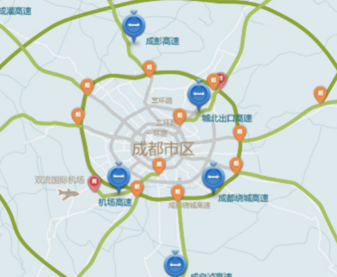

图4-1：成都市道路规划（2019年）

c. 市区平均等待接客时间$$t^{''}$$=9.8min；

估算方法：选取30辆出租车在工作日和周末的数据，根据上文介绍的方法，计算出相邻下车点和上车点的时间点之差，并取均值，得到出租车在市区平均空载时间为9.8min；

d. 市区道路正常情况下平均时速约为55km/h；

估算方法：根据成都市[交通运输局公布的道路限速情况和智能导航软件给出的历史数据，得到正常情况下平均时速](http://www.baidu.com/link?url=2-t6RaogIOYGe1eOrygVhwnvrzC0G0fxbPQOgDs_RZObjz2zRAh-83lnS-zSu4D-)为50km/h;

e.
机场到达旅客的平均乘出租里程$$S_{0}$$=22km（仅考虑进入市区，如到省人民医院），对应平均载客时长为$$T$$
=37min

估算方法：主要利用智能导航软件，获得一天内各个时段的预计时间，再结合2014年成都市交通状况，得到平均载客时长

1.  司机可以直接观测到的数据

包括司机可观测的蓄车池中车辆数目$$n_{c}$$，司机可观测的未来到港航班数目$$n_{f}$$，拥堵情况系数$$\beta$$，可通过当地交通委发布的实时路况和智能导航软件得出。

### $$\alpha$$和AHP模型判断矩阵计算

1.  $$\alpha$$为正常情况下选择乘坐出租车的到港旅客人数占到港总人数的比例

>   计算方法：

a.
根据已有数据，随机选取12个工作日（周一至周四）和9个周末（周五至周日）的出租车信息，利用上文所述“出租车一日数据处理”方法，将最终筛选出的上车点信息数目作为当日机场出租车接客车次数，并根据假设每辆出租平均载2名乘客，相乘后即得出当日到港旅客中选择乘坐出租车的旅客人数：

当日乘坐出租车的到港旅客人数 = 上车点信息数目 × 出租车平均载客量 ；

b.
在flightstats网站（www.flightstats.com）查询对应日期的成都市双流机场的各时段到港航班数量总和，再乘上航班平均载客量，得到当日到港总人数；

c. 结合文献资料，计算出2014年成都双流机场的$$\alpha$$值为48.3%

$$\alpha = \frac{}{}$$ (4-1)

1.  利用AHP层次分析法构建判断矩阵

通过文献查阅和已有调研资料，得到对上述五个因素（季节，所处时间段、所处星期、天气、社会）对成都市司机对$$\alpha$$值的影响程度的主观评价矩阵为

其中1-5列对应的因素依次为旅游季节，所处时间段，所处星期，天气状况和市区重大活动。

运用Matlab程序，得到报告如下：

一致性指标：0.019442；

一致性比例：0.017359；

一致性检验结果：通过；

特征值：5.0778；

权向量：(0.085834 , 0.49778 , 0.13915 , 0.22416 , 0.053081)。

即判断矩阵$$\text{Ri}$$通过一致性检验，从报告可得其对应权重向量为

$$\omega = (0.085834\ ,\ 0.49778\ ,\ 0.13915\ ,\ 0.22416\ ,\ 0.053081)$$，

其中第k个元素表示第k个因素对$$\alpha$$的影响权重。

### 各情况矫正系数计算

1.  时间段矫正系数（$$\lambda_{21,}\lambda_{22}$$）计算

2.  确定高低峰时间段

考虑到控制变量，我们选取8月内10组正常天气下工作日的出租车和航班数据。将机场出租车上车点信息，按小时时段绘制出频数分布直方图。如图
所示，频率越高代表该时段出租车接客人数多，即处于接客高峰期。综合5组数据和实际情况后，拟定高峰期时段为10,11,13,14,15,17,18,22,23共9个时段，其余时段为低峰期。

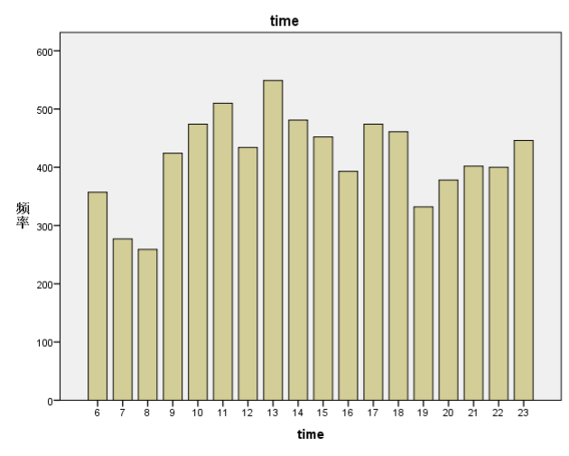

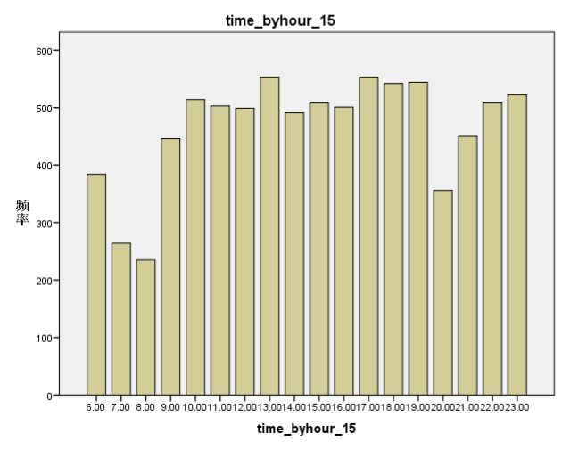

图4-2：分时段上车点频数分布直方图

1.  计算两种时间段到港乘客中选择乘坐出租车的比例$$\overset{\overline{}}{\alpha_{21}},\overset{\overline{}}{\alpha_{22}}$$

将10日的数据均分为两个时段，分别计算后取出平均值，得到对应比例。以8月4日（多云周一）数据为例。假设当日各时段到港航班载客量和出租车载客量不变。

表4-1：8月4日基本情况表

| **8月4日**         |          |            |
|--------------------|----------|------------|
| 特征               | 多云周一 |            |
| 到港航班数         | 291      |            |
|                    | 高峰     | 142        |
|                    | 低峰     | 149        |
| 平均每班航班载客量 | 110      |            |
| 总到港人数         | 32010    |            |
| 出租车接客车次数   | 7504     |            |
|                    | 高峰     | 4247       |
|                    | 低峰     | 3257       |
| 出租车平均载客量   | 2        |            |
| 乘坐出租车比例     | **高峰** | **54.38%** |
|                    | **低峰** | **39.74%** |

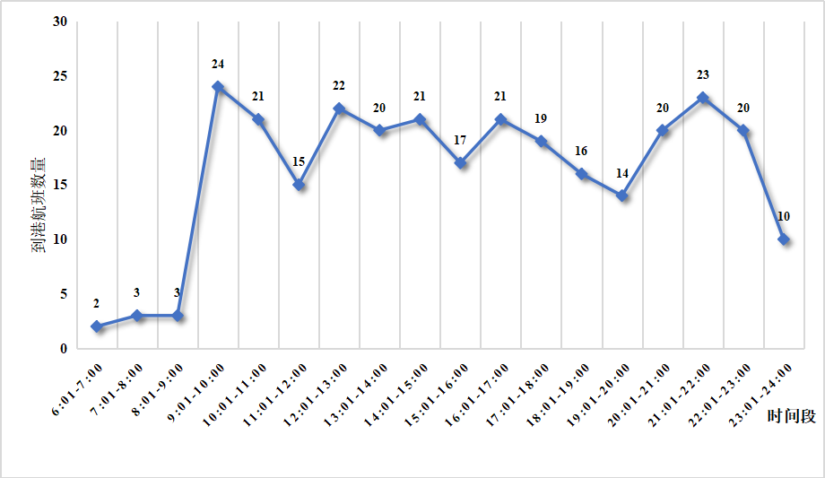

图4-3：8月4日6:00-24:00到港航班数量

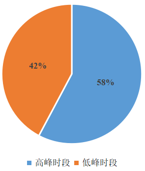

图4-4：不同时段选择出租车的人数比例

利用公式$$\lambda_{21} =
\frac{\overset{\overline{}}{\alpha_{21}}}{\alpha},\lambda_{22} =
\frac{\overset{\overline{}}{\alpha_{22}}}{\alpha}$$计算出在其他因素都处于正常的情况下，低峰时段矫正系数为$$\lambda_{21}
= 0.85$$，$$\lambda_{22} = 1.16$$。

1.  星期矫正系数（$$\lambda_{31,}\lambda_{32}$$）计算

根据双流机场的历史运营情况，将星期因素分为周一至周四工作日（31）和周五至周日周末（32）。考虑到控制变量，我们选取8月内其他因素处于正常情况的4个工作日和4个周末的出租车和航班数据。利用上述方法计算每日平均乘出租车比例$$\alpha_{i}$$，按星期因素分成两类后，分别计算两种状态下到港乘客中选择乘坐出租车的比例$$\overset{\overline{}}{\alpha_{31}},\overset{\overline{}}{\alpha_{32}}$$。利用公式$$\lambda_{31}
= \frac{\overset{\overline{}}{\alpha_{31}}}{\alpha},\lambda_{32} =
\frac{\overset{\overline{}}{\alpha_{32}}}{\alpha}$$计算出在其他因素处于正常的情况下，工作日期间时矫正系数为$$\lambda_{31}
= 0.92$$，$$\lambda_{32} = 1.1$$。

1.  天气矫正系数（$$\lambda_{41,}\lambda_{42}$$）计算

根据成都历史天气状况（可由全球天气网http://lishi.tianqi.com/chengdu/201408.html中历史天气栏目得到）和文献资料，将天气分为适宜（41）和大雨大风等较恶劣天气情况（42）。考虑到控制变量，我们选取8月内10日其他因素正常，但天气状况有差异的出租车和航班数据。利用上述方法计算每日平均乘出租车比例$$\alpha_{i}$$，按天气状况分成两类后，分别计算两种天气状况下到港乘客中选择乘坐出租车的比例$$\overset{\overline{}}{\alpha_{41}},\overset{\overline{}}{\alpha_{42}}$$。利用公式$$\lambda_{41}
= \frac{\overset{\overline{}}{\alpha_{41}}}{\alpha},\lambda_{42} =
\frac{\overset{\overline{}}{\alpha_{42}}}{\alpha}$$计算出在其他因素都处于正常的情况下，天气适宜时矫正系数为$$\lambda_{41}
= 0.9$$，$$\lambda_{42} = 1.12$$。

1.  季节矫正系数（$$\lambda_{11,}\lambda_{12}$$）和社会矫正系数（$$\lambda_{51,}\lambda_{52}$$）估计

由于获取的出租车记录数据的时间局限性在8月，此时处于旅游季节的旺季且无重大社会活动，没有对照可用且可计算的$$\alpha$$值，因此这两种因素分别对应的矫正系数由资料和参考文献得出。实际上，季节因素和社会因素对乘客选择乘坐出租车的意愿影响不大，且全年范围内市区内承办重大社会活动的天数所占比例很小，因此设定淡季矫正系数$$\lambda_{11}
= 0.9$$，$$\lambda_{12} = 1.1$$，市区无重大社会活动矫正系数为$$\lambda_{51} =
1$$，$$\lambda_{52} = 1.1$$。

模拟决策计算
------------

### 算法设计

根据问题一中的模型，设计出对应算法，用Python实现。

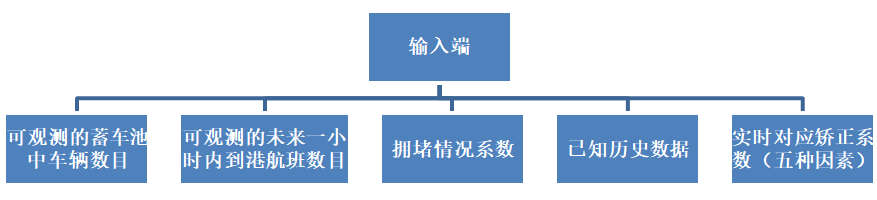

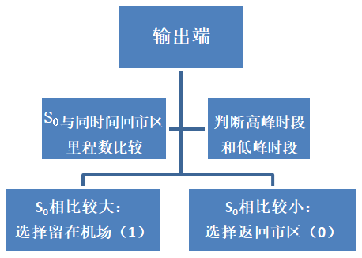

图4-3 :算法流程图

为下一步验证模型合理性，选取8月中3日的数据（分别为4号，9号和15号），将出租车信息和航班信息按照小时数分成6点至23点间，共18个时段。按照问题一中设定的模型，分别计算每个时段决策结果以0-1形式表示，0代表返回市区，1代表留在机场。此处以8月4日8:00-9:00时段为例展示判断过程。

### 实例计算——8月4日8:00-9:00成都双流机场

根据实际情况，此时处于低峰时段，可观测预计一小时内航班到达数量较少（5架）。且晚间停留在蓄车池出租车数量较多，根据出租车信息得约停留出租车为100辆,返回市区拥堵系数$$\beta
= 1.05$$。五种因素和矫正系数分别处于“旺季$$\lambda_{12} =
1.1$$，低峰期$$\lambda_{21} = 0.85$$，工作日$$\lambda_{31} =
0.92$$，天气适宜$$\lambda_{41} = 0.9$$，市区无重大活动状态$$\lambda_{51} =
1$$”，结合司机对五种因素的权重向量$$\omega = \left( 0.085834,\ \ 0.49778,\
0.13915,\ 0.22416,\ 0.053081 \right)$$，计算出当前乘坐出租车比例预计为$$\alpha =
0.91 \times \overset{\overline{}}{\alpha}$$，即$$\alpha =
43.96\%$$。进而计算出且若在机场停留，预计等候时间为38min。根据已有历史数据，代入公式(1-4)，计算出方案2（返回市区）期望载客里程为：

$$S = \left( t + T - t^{'} - t^{''} \right) \times \frac{v_{2}}{\beta} = \left(
38 + 37 - 25 - 9.8 \right) \times \frac{50}{1.05 \times 60} = 31\text{km}$$ 。

由历史数据，载客进入市区的平均里程为$$S_{0} = 22\text{km}$$，显然有$$S_{0} <
\text{\
S}$$，因此该时刻司机应选择返回市区。其余时间段和天数计算方法类似，利用附录2的Python程序，可得到这三日内每时段的决策情况。

模型合理性检验
--------------

### 数据准备

基于计算获得的三日各时段的决策情况和利用机场出租车上下车点信息得到的个各车次是否停留的状态，利用SPSS统计频数得到各时段的真实选择情况。为检验模型的判断存在合理性，考虑到未有模型时的随机决策情况，我们采用随机数生成的方法，生成三日内各时段随机情况。因停留情况综合了机场出租车所有司机的真实决策，假设其为合理决策，分别计算决策情况与随机数情况与真实情况的误差，比较所构建模型的合理性。

### 选取常用计算误差指标

1.  MSE 均方误差：参数估计值与参数真值之差平方的期望值;
    MSE可以评价数据的变化程度，MS的值越小，说明预测模型描述实验数据具有更好的精确度。计算方法：

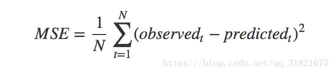

(4-2)

1.  RMSE 均方误差：均方根误差是均方误差的算术平方根。计算方法：

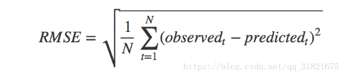

(4-3)

1.  MAE 平均绝对误差是绝对误差的平均值：
    平均绝对误差能更好地反映预测值误差的实际情况。计算方法：

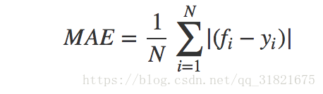

(4-4)

### 模型计算和检验结果

表4-2：三日各时段决策和随机数结果

| 日期 | time_byhour_04 | time_byhour_09 | time_byhour_15 |         |           |         |
|------|----------------|----------------|----------------|---------|-----------|---------|
| 时段 | 0：不停留      | 1：停留        | 0：不停留      | 1：停留 | 0：不停留 | 1：停留 |
| 6    | 0.35           | 0.65           | 0.31           | 0.69    | 0.30      | 0.70    |
| 7    | 0.30           | 0.70           | 0.26           | 0.74    | 0.35      | 0.65    |
| 8    | 0.26           | 0.74           | 0.26           | 0.74    | 0.21      | 0.79    |
| 9    | 0.20           | 0.80           | 0.18           | 0.82    | 0.18      | 0.82    |
| 10   | 0.25           | 0.75           | 0.21           | 0.79    | 0.22      | 0.78    |
| 11   | 0.22           | 0.78           | 0.25           | 0.76    | 0.21      | 0.79    |
| 12   | 0.22           | 0.78           | 0.22           | 0.78    | 0.29      | 0.71    |
| 13   | 0.19           | 0.81           | 0.22           | 0.78    | 0.21      | 0.79    |
| 14   | 0.15           | 0.85           | 0.24           | 0.76    | 0.18      | 0.82    |
| 15   | 0.20           | 0.81           | 0.19           | 0.81    | 0.18      | 0.82    |
| 16   | 0.32           | 0.68           | 0.17           | 0.83    | 0.26      | 0.74    |
| 17   | 0.27           | 0.73           | 0.21           | 0.79    | 0.18      | 0.82    |
| 18   | 0.18           | 0.82           | 0.22           | 0.78    | 0.20      | 0.80    |
| 19   | 0.18           | 0.82           | 0.19           | 0.81    | 0.12      | 0.88    |
| 20   | 0.18           | 0.82           | 0.16           | 0.84    | 0.25      | 0.75    |
| 21   | 0.18           | 0.82           | 0.15           | 0.85    | 0.13      | 0.87    |
| 22   | 0.12           | 0.88           | 0.05           | 0.96    | 0.07      | 0.93    |
| 23   | 0.36           | 0.65           | 0.15           | 0.85    | 0.25      | 0.75    |

表4-3：三日决策值和随机数误差分析

| 日期           | MSE    | RMSE   | MAE    |        |        |        |
|----------------|--------|--------|--------|--------|--------|--------|
|                | 决策值 | 随机数 | 决策值 | 随机数 | 决策值 | 随机数 |
| time_byhour_04 | 0.244  | 0.376  | 0.494  | 0.613  | 0.416  | 0.548  |
| time_byhour_09 | 0.221  | 0.419  | 0.470  | 0.647  | 0.379  | 0.577  |
| time_byhour_15 | 0.138  | 0.343  | 0.371  | 0.585  | 0.299  | 0.505  |

通过计算结果发现，根据模型的决策值比随机决策情况的各项误差值要小，说明构建模型相较于随机决策，有助于帮助机场出租车司机更准确判断是否应留在机场等待接客。

相关因素依赖性和结论
--------------------

### 依赖性分析

在问题一决策模型中，需要机场出租车司机较准确判断的重要指标为到港旅客乘坐出租车比例$$\alpha$$。在目前导航设施和信息发布平台逐步完善的情况下，司机可准确得到包括蓄车池车辆数，未来一小时航班到港数等客观数据。因此，结合根据实例大量数据分析，AHP层次分析法和计算结果，发现该模型对主观判断因素的依赖性较强，包括季节，所处时间段、所处星期、天气、社会因素。司机需根据个人经验，判断真实情况下因素两两间的重要性程度（实例分析给出了一种参考判断矩阵）。若能准确判断一段时间内候车点排队人数，则司机可作出最合理的决策。

### 结论

1.  根据历史数据和调研结果，七成以上出租车司机不会选择空载回到市区；

2.  旺季，乘客到港高峰期，周末时期，较恶劣天气以及市区有重大社会活动时，乘客选择乘坐出租车的比例将会上升，可选择留在机场；

3.  一天中时间段对司机决策影响最大，其次因素为天气，星期，季节和重大活动；

4.  一天中选择空载离开机场时间段集中在上午6:00-9:00期间，中午12:00-13:00到港航班较少期间和19:00-21:00期间，选择原因包括乘坐出租车人数少，道路拥堵程度适中，城市出租车需求量大等。

问题三的模型建立与求解
======================

对于如何设置上车点使总的乘车效率最高，由于乘客、空车前往上车点到乘客乘车离开可看作一套完整的排队系统，可采用$$M/M/C$$排队系统模型对问题进行求解。

模型假设
--------

### 各服务台服务工作相对独立，且平均服务速率相同。即$$\mu_{1} = \mu_{2} = \cdots\mu_{c}$$=$$\ \mu$$；

### 一辆出租车对应一个乘客，服务方式为单个服务；

### 乘客在离站的高峰时段内，系统输入端的客源是无限的，排队空间是无限的，并且乘客遵循先到先服务的排队规则。

### 乘客到达间隔时间服从参数为$$\lambda_{0}$$的泊松分布，服务时间服从参数为$$\mu_{0}$$的负指数分布。

模型的建立
----------

### 上车点数目确定

1.  $$M/M/C$$模型流程

$$M/M/C$$排队服务系统由输入、输出、服务规则、服务设施四部分组成，其中乘客、空车作为输入，上车点为服务台，载客出租车作为输出。由于题目所给机场拥有两条车道，可设置多个互不干扰的服务台减少乘客排队的时间成本，且$$M/M/C$$系统比C个M/M/1系统在效率上具有显著优越性。由于多队多服务台系统不利于机场载客区管理，容易导致乘车混乱，造成效率和安全性的降低，小组最终选取单队多服务台并联为出租车系统的基本模型。对乘客和司机成本之和进行最小化处理，可确定最优服务台个数，即确定最有效率的乘车点安排。

出租车排队模型本质上是空车与乘客的双端排队系统，考虑到有管理人员对出租车实施定量放行，且可在机场设立显示屏，实时播报蓄车池内车辆和排队乘客数，根据博弈论思想，以上政策可对出租车排队具有一定划导向作用。本模型主要以乘客作为顾客（输入），即认为各个上车点（服务台）出租车与乘客数量相匹配。

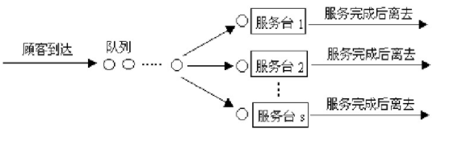

图5-1：出租车排队服务系统简图

图5-2：单队列多服务台并联排队系统示意图

1.  $$M/M/C$$模型建立

各服务台工作互不干预，且平均服务速率相同。即$$\mu_{1} = \mu_{2} =
\cdots\mu_{C}$$=$$\
\mu$$，在高峰时段整个服务机构的平均速率是$$\text{Cμ}$$，且服务器的服务强度$$\text{\
ρ} =
\frac{\lambda}{\text{Cμ}}$$恒\<1，保证系统不会处于无限繁忙状态，系统可达到稳态。

由于乘客到达间隔时间服从参数为$$\lambda_{0}$$的泊松分布，服务时间服从参数为$$\mu_{0}$$的负指数分布，可得长度为$$t$$的时间单位内可能到达n个乘客的概率为和服务时间的密度函数。

$$P_{n}\left( t \right) = \frac{{(\lambda_{0}t)}^{n}}{n!}e^{- \lambda_{0}t\
}\text{\ \ \ \ \ \ \ \ \ }t > 0\ ,n = 0,1,2,\cdots$$ (5-1)

$$f_{V}\left( t \right) = {\mu_{0}e}^{- \mu_{0}t}$$ (5-2)

查阅资料可得$$M/M/C$$标准系统达到稳态时，c个服务台并联工作，顾客到达数为n的概率为：

$$P_{0}\left( C \right) = {\lbrack\sum_{k = 0}^{C - 1}\frac{1}{k!}\left(
\frac{\lambda_{0}}{\mu_{0}} \right)^{k} + \frac{1}{C!}\frac{1}{(1 - \rho)}\left(
\frac{\lambda_{0}}{\mu_{0}} \right)^{C}\rbrack}^{- 1}$$ ； (5-3)

$$P_{n}\left( C \right) = \left\{ \begin{matrix} \frac{1}{n}\left(
\frac{\lambda_{0}}{\mu_{0}} \right)^{k}P_{0}\left( C \right)\text{\ \ \ \ \ \ \
\ \ \ \ \ \ \ \ \ \ }n = 1,2,\cdots C \\ \frac{1}{C!C^{n - C}}\left(
\frac{\lambda_{0}}{\mu_{0}} \right)P_{0}\left( C \right)\text{\ \ \ \ \ }n = C +
1\& \\ \end{matrix} \right.\$$ 。 (5-4)

计算系统中乘客排队的队长$L_{s}$及其平均逗留时间$W_{s}$（从顾客到达时刻起到他接受服务完成这段时间）：

$$L_{s} = L_{q} + C\rho = \frac{1}{C!}\frac{{(C\rho)}^{C}\rho}{{(1 -
\rho)}^{2}}P_{0} + \frac{\lambda_{0}}{\mu_{0}}$$ (5-5)

$$E\left( W_{s} \right) = \frac{P_{n}\left( C \right)}{C\mu_{0}{(1 - \rho)}^{2}}
= \frac{n\mu_{0}}{n!\left( n\mu_{0} - \lambda_{0} \right)^{2}}\left(
\frac{\lambda_{0}}{\mu_{0}} \right)^{n}P_{0}(C)$$ (5-6)

1.  模型的动态最优解

>   在稳态情形下，单位时间全部费用（服务成本和等待费用）的期望值为

$$\mathcal{z} = c_{s}^{'}*C + c_{w}*L_{s}$$ ， (5-7)

其中$C$为服务台数目，$c_{s}^{'}$为单位时间服务台的成本，$c_{w}$为每个顾客在系统停留单位时间的成本，可通过当地实际情况和历史数据获得，$L_{s}$为系统中排队等待的顾客数与正在接受服务的顾客数之和。

由于$C$只能取整数，$\mathcal{z}$非连续函数，采用边际分析法求其最小值：

$$\left\{ \begin{matrix} \mathcal{z}\left( C^{*} \right) \leq \mathcal{z}\left(
C^{*} - 1 \right) \\ \mathcal{z}\left( C^{*} \right) \leq \mathcal{z}\left(
C^{*} + 1 \right) \\ \end{matrix} \right.\$$ ， (5-8)

即

$$L\left( C^{*} \right) - L\left( C^{*} + 1 \right) \leq \frac{c_{s}^{'}}{c_{w}}
\leq L\left( C^{*} - 1 \right) - L\left( C^{*} \right)$$ *。* (5-9)

由于$\frac{c_{s}^{'}}{c_{w}}$为已知数，以此计算相邻$L$值的差，根据结果所处区间位置确定$C$的最优取值。

1.  模型检验

构建单队多服务台系统的模拟流程图，运用蒙特卡罗仿真模型，通过Matlab生成10000以上随机数计算相应的$W_{q}$，$W_{s}$与理论值进行比较，发现二者差异随数据数目增多逐渐减小，证明模型建构合理且准确。

以北京站数据为例，查阅文献得北京站的乘客到达率$\lambda_{0}$=6人/min，服务率$\mu_{0}$=4人/min，乘客等待时间成本与服务台成本之比为1∶500，即$\frac{c_{s}^{'}}{c_{w}}
= 0.002$。

结合以上数据尝试给出$C^{*}$值代入公式可得：

表5-1：费用决策模型计算过程

| Ls（1）-Ls（2） | \-6.4286 |
|-----------------|----------|
| Ls（2）-Ls（3） | 1.6917   |
| Ls（3）-Ls（4） | 0.1921   |
| Ls（4）-Ls（5） | 0.0361   |
| Ls（5）-Ls（6） | 0.0071   |
| Ls（6）-Ls（7） | 0.0013   |
| Ls（7）-Ls（8） | 0.0002   |

由上述计算结果可得，当$C$=6时，满足公式即乘客与服务台成本之和最小。因此当出租车上客区设置6
个上客点时，可实现排队系统的费用相对较小。

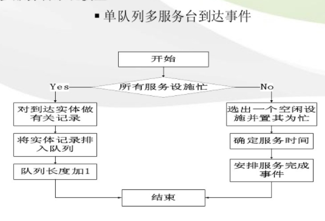

图5-3：单队列多服务台到达事件示意图

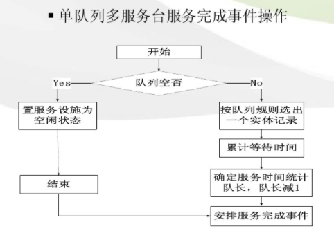

图5-4：单队列多服务台完成事件示意图

### 上车点位置确定

1.  上车点方案选择

确定乘车点个数后，可根据实际情况选择上车点的位置。模型要求各服务台互不影响，可选方案有以下两类：

方案A：选择以一条车道作为枢纽车道，空车载客后即进入枢纽车道驶出，枢纽车道本身不设置上车点，也不允许空车驶入。

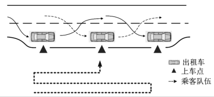

图5-5：方案A示例

方案B：空车两条车道均可驶入，乘客可自由选择上车点和车道。管理人员可根据实际情况选择在道路前端点或在道路两侧安排上车点，减少人车冲突。

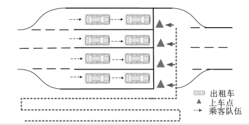

图5-6：方案B示例

运用成本效益模型，通过计算比较两种方案的总成本（$\mathcal{W}$），根据机会成本理论，选取总成本最小的方案。

方案A避免了乘客穿越车道带来的时间成本和暗含的安全危机，但快车道的设立会导致单位时间内载客区车辆较少，效率低于运用双车道载客的方案B，产生效率损失成本$\mathcal{W}_{l}$，

$$\mathcal{W}_{A} = \mathcal{W}_{bA} + \mathcal{W}_{l}$$  (5-10)

方案B在一定程度上增加了总的乘车效率，但可能会导致人车冲突，产生安全隐患成本（$\mathcal{W}_{s}$）且会带来内侧车道出租车等待乘客完全通过的时间成本（$\mathcal{W}_{t}$），

$$\mathcal{W}_{B} = \mathcal{W}_{bB} + \mathcal{W}_{s} +
+\mathcal{W}_{t}$$ ， (5-11)

其中，$\mathcal{W}_{bA,}\mathcal{W}_{bB}$为根据方案建设上车点的成本，管理部门比较$\mathcal{W}_{A}$、$\mathcal{W}_{B}$大小后选择成本较小的方案。

1.  上车点位置坐标确定

在选择方案后，管理部门需根据实际情况选择每个上车点的空间坐标，可根据管理部门需求和实地条件限制建立规划模型

$$
\mathcal{F} = min\sum_{}^{}f_{i}\ i = 1,2,\cdots
$$

$$
\text{fi} = F(x_{1},x_{2,\cdots}x_{j})
$$

$$\left\{ x_{1},x_{2,\cdots}x_{j} \right\} \in \chi$$ (5-12)

其中$f_{i}$为乘客从某一上车点$i$到达各个出租车（即接受服务）的空间位移,且$f_{i}$受$x_{1},x_{2,\cdots}x_{j}$（如上车点位置，出租车停车位置，单批出租车流量等）因素的影响，管理人员根据实际情况对$$x_{1},x_{2,\cdots}x_{j}$$加以限制，可求出限制下$\mathcal{F}$的最优解和此时$x_{1},x_{2,\cdots}x_{j}$的取值，进而得出最优的上车点规划方案。

问题四结论
----------

管理部门通过$$M/M/C$$模型确定最优上车点数目，比对$\mathcal{W}_{A}$、$\mathcal{W}_{B}$大小后通过条件规划选择最终方案。同时可在蓄车池和乘客排队区设立显示屏，实时播报各排队区成员数量，方便成员做出排队决策直至达到稳定状态，最终实现总乘车效率的最大化。同时，增加适当调度员，协调出租车和乘客秩序，更好的保障乘客安全。

问题四的模型建立与求解
======================

优化方案
--------

由于机场出租车司机不能选择乘客和拒载，短途载客司机付出了与长途司机相同的排队时间成本后，在离开机场相同时间内，面临乘客下车后的空载风险，平均收益必然小于长途司机。为均衡短途和长途载客出租车的收益，可对短途载客再次返回的出租给予一定的“优先权”：根据当地实际情况设定$t_{\mathbf{f}}$，在$t_{\mathbf{f}}$时间内返回的出租车司机可以不进入待运区，直接通过绿色通道到等候区重新拉客，这减少了短途司机的等待时间成本，从而缩小长短途司机的收益差距。

优化模型中的假设
----------------

1.  只考虑足够长的$t_{}$内车辆运行收益，且车辆最多返回一次。

2.  短途出租车在乘客下车后可选择空载进入市区或空载返回机场，进入市区内司机不再返回且永不空载。

3.  司机收益$$R = v \times t \times
    P$$,其中$v$（平均速度），$R_{0}$（起步价）和$P$（里程单价）均为常数，以载客时间替代司机收益。在$t_{}$一定的情况下，空载时间越短，司机收益越高。

4.  司机返回机场再次载客排队时间$t_{q}$恒定。

模型的建立
----------

设出租车返回市区所需时间为$t_{b}$,出租车第一次载客时间为$t_{1}$，排队时间为$t_{q}$,
“优先权”设定时间为$t_{\mathbf{f}}$,总空载时间为$t$。

若$t_{b} \leq
t_{q}$,则司机即使返回市区时全程空载，空载时间也会小于返回排队时间，此时司机必然会选择空载进入市区，$t
= t_{b} - t_{1}$。

### 不存在优先权

若$t_{1} \geq t_{b}$,则出租车返回市区，不存在空载，$t = 0$；

若$t_{b} - t_{1} \leq t_{1} +
t_{q}$,则司机空载进入市区的空载时间小于返回机场并排队的时间，司机会选择空载进入市区，此时$t
= t_{b} - t_{1}$；

若$t_{b} - t_{1} > t_{1} + t_{q}$,
则司机空载进入市区的空载时间大于返回机场并排队的时间，司机会选择返回机场排队，此时$t= t_{1} + t_{q}$；

若$t_{b} \leq
t_{q}$,则司机即使返回市区时全程空载，空载时间也会小于返回排队时间，此时司机必然会选择空载进入市区，$$t
= t_{b} - t_{1}$$。以下仅考虑$t_{b}{> t}_{q}$的情形：

$$t = \left\{ \begin{matrix} 0\text{\ \ }{\text{\ \ \ \ \ \ \ \ \ \ \ \ \ \ \ \
\ \ \ \ \ \ \ \ \ \ \ \ \ \ \ }t}_{1} \geq t_{b} \\  \\ \begin{matrix} {\text{\
\ \ \ \ \ \ \ }t_{1} + t_{q}\text{\ \ \ \ \ \ \ }t}_{1} < \min\left\{
t_{b},(\frac{t_{b} - t_{q})}{2} \right\} \\  \\ \text{\ \ \ \ \ \ \ \ }t_{b} -
t_{1}\ \ \ \ \ \ \ \ \ \ \ \ \ (\frac{t_{b} - t_{q})}{2} \leq t_{1} < t_{b} \\
\end{matrix} \\ \& \\ \end{matrix} \right.\$$ (6-1)

### 存在优先权

当$2t_{1} \leq
t_{f}$时,认为司机属短途载客，可以选择返程进入绿色通道或空载进入社区。

当$t_{b} - t_{1} \leq
t_{1}$时,司机空载进入市区的空载时间小于返回机场的时间，司机会选择空载进入市区，此时$t
= t_{b} - t_{1}$。

当$t_{b} - t_{1} >
t_{1}$时,司机空载进入市区的空载时间大于返回机场的时间，司机会选择返回机场进入绿色通道接客，此时$t
= t_{1}$。

当$2t_{1} > t_{f}$时,认为司机属长途载客，可以选择返程排队接客或空载进入市区。

当$t_{1} \geq t_{b}$时,出租车返回市区，不存在空载，$t = 0$。

当$t_{b} - t_{1} \leq t_{1} +
t_{q}$时,司机空载进入市区的空载时间小于返回机场并排队的时间，司机会选择空载进入市区，此时$t
= t_{b} - t_{1}$。

当$t_{b} - t_{1} > t_{1} + t_{q}$时,
则司机空载进入市区的空载时间大于返回机场并排队的时间，司机会选择返回机场排队，此时$t
= t_{1} + t_{q}$，

$$t = \left\{ \text{\ \ \ \ \ \ }\begin{matrix} 0\ \ \ \ \ \ \ \ \ \ \ \ \ \ \ \
\ \ \ \ \ \ \ \ \ \ \ \ t_{1} \geq \max\left\{ t_{f}/2,t_{b} \right\} \\
{t_{1}\text{\ \ \ \ \ \ \ \ \ \ \ \ \ \ \ \ \ \ \ \ \ \ \ }t}_{1} \leq
\min\left\{ t_{b}/2,t_{f}/2 \right\} \\ \begin{matrix} \text{\ \ \ \ \ \ }t_{b}
- t_{1}\text{\ \ \ \ \ \ \ \ }\left\{ \begin{matrix} \frac{t_{f}}{2} \leq t_{1}
\leq \frac{t_{b}}{2} \\ t_{1} \geq \max\left\{ \ \frac{t_{f}}{2},(\frac{t_{b} -
t_{q})}{2} \right\} \\ \end{matrix} \right.\ \text{\ \ } \\ \text{\ \ \ \ \ \ \
\ \ \ \ \ \ \ \ \ \ \ \ \ \ \ \ \ \ \ \ \ \ \ \ \ \ \ \ \ \ \ \ } \\ t_{1} +
t_{q}\text{\ \ \ \ \ \ \ \ \ \ \ \ \ \ \ \ \ \ \ \ \ \ \ }\frac{t_{f}}{2}{<
t}_{1} < (\frac{t_{b} - t_{q})}{2} \\ \end{matrix} \\ \end{matrix} \right.\$$ 。
(6-2)

模型的检验
----------

为证明该“优先权”模型可以均衡长短途司机收益，可利用matlab程序（详见附录）生成一组样本量为10000的正态随机数作为$t_{1}$，计算采用“优先权“前后$t$的均值和方差等参数，对两组数据的分散程度进行描述，比对证明长短途司机收益差距缩小，模型建立合理。

以北京首都机场为例。通过查阅文献可得北京首都国际机场平均数据：$t_{b}$=1.5h，$t_{q}$=0.5h。用"$3\delta$"原则估计$t_{1}\sim$N(1,0.25)，$t_{f}$设定为1h。将以上参数构成的参数向量输入matlab程序，运行得到构建“优先权”前后t的均值与方差。

表6-1 优化模型检验结果

| 构建前        | 构建后        |
|---------------|---------------|
| mean1 =0.4993 | mean2 =0.4886 |
| var1 =0.0549  | var2 =0.0515  |

比较均值和方差可得，构建“优先权”后司机平均空载时间降低，且空载时间分布更加集中，即相同$t_{}$内平均载客里程增加且载客里程差异缩小，最终导致司机收益差距缩小，长短途司机收益更加均衡，即模型有效。

模型局限性
==========

模型优点
--------

筛选出机场处出租车信息后，根据出租车载客状态的变化得到上下车点的出租车ID和具体时刻信息，根据上车点信息可计算出当日接客人数和时刻；根据下车点信息可得出租车落客时间，两者综合可推测出每车次出租车到达机场落客后的行驶状态，符合题目要求。因常用GIS方法分析轨迹的方法在数据量很多的情况下较为复杂，短时间内不易得到结论，因此创新性利用时刻和ID数据，推测出租车状态。

模型局限性
----------

1.  所获得的数据所处时段具有局限性，集中于8月，无法直接从数据中计算出影响乘坐出租车比例的季节因素和社会因素；出租车时间信息不包括机场出租车运营高峰凌晨1点-2点时段。

2.  模型和出租车信息分析适用于较为理想的状态下，例如机场出租车不得越过蓄车池直接“拉客”，需按照次序接客；到港乘客都将进入市区等合理假设。且不考虑博弈论中，大多数司机参考模型得到相同决策时，存在进行逆向选择的机会；

3.  收益仅考虑为里程数，且以相同时间内最大化里程数为目标。实际上，出租车司机在蓄车池等候时可进行休息时获得的健康收益为隐性收益；

4.  模型检验中因时间和人力限制，仅选择三天进行检验，样本量少且三天内情况集中且无极端情况出现，结论可靠性不强。

**参考文献**

[1] 王贝贝.基于北京市载客热点区的出租车出行需求研究[D].北京:北京交通大学,2018.

[2] 林思睿.机场出租车运力需求预测技术研究[D].四川:电子科技大学,2018.

[3] 魏中华,王琳,邱实.基于排队论的枢纽内出租车上客区服务台优化[J].公路交通科技·应用技术版,2017,13(10):298-300.

[4] 王安宇,黄宋丹."出租车司机MBA课"的经济学思维[J].生产力研究,2008,(5):21-22.

[5] 湖北大学.一种基于轨迹挖掘的出租车等待时间预测方法及系统:CN201910075120.0[P].2019-05-28.

[6] 高聪.基于GPS数据的出租车推荐系统的研究[D].湖北:武汉理工大学,2016.

